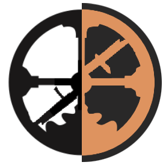

# Dark Roam

A dark, gruvboxy theme for [Roam Research](https://roamresearch.com/). Highly customizable and easy hackable.

## Features
- Dark mode
- Total color customization
- Select your own font

## Installation
You have to install [Stylus](https://add0n.com/stylus.html) and then click on this install link below.  

## License
Code is released under the [Blue Oak Model License.](LICENSE.md)

## Trivia
Inspired by [theianjones](https://github.com/theianjones/roam-research-themes).